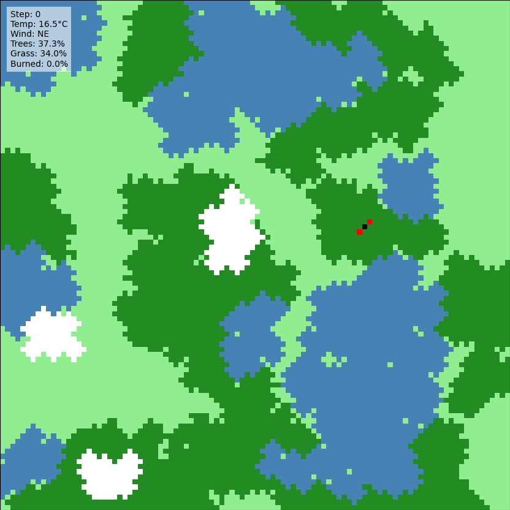

##  Wildfire Simulation.

**Project description:** The project simulates forest fire dynamics, integrating natural factors such as wind, temperature, and vegetation. A grid-based model represents landscape elements like trees, water and ash. Key features include temperature-driven fire behavior, wind-influenced fire spread, and post-fire regeneration through rainfall. The simulation emphasizes the interaction of ecological processes and randomness, offering insights into environmental dynamics. Python and Matplotlib were used to implement the model, which visualizes the cyclical nature of destruction and renewal over time.

[View report](notebooks\wildfire_simulation.ipynb)
